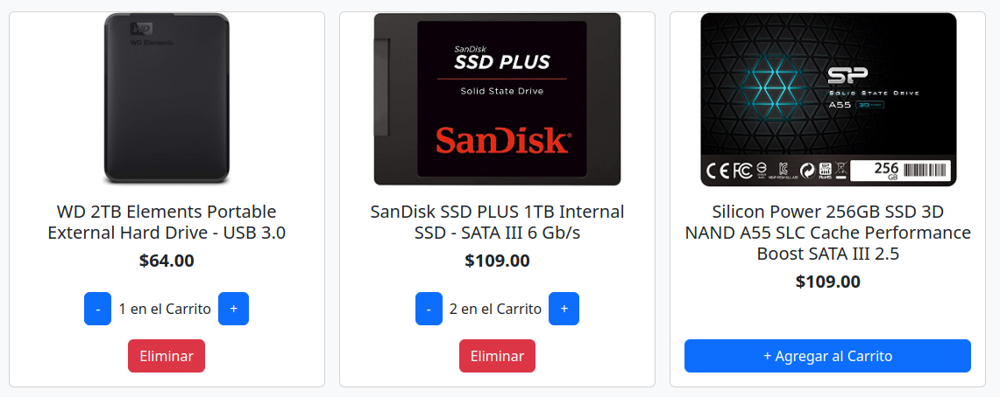
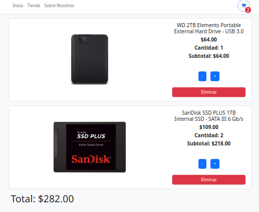

# Carrito de compras

https://tienda-productos-electronicos.netlify.app/

Aplicación  de una tienda falsa de productos electrónicos con React.

Se pueden agregar productos al carrito, aumentar/disminuir su cantidad y eliminarlos.

El carrito muestra todos los productos agregados y el total.

La aplicación utiliza React Router para navegar entre páginas y localStorage para almacenar el carrito.

Los productos son obtenidos de la API FakeStore https://fakestoreapi.com/
